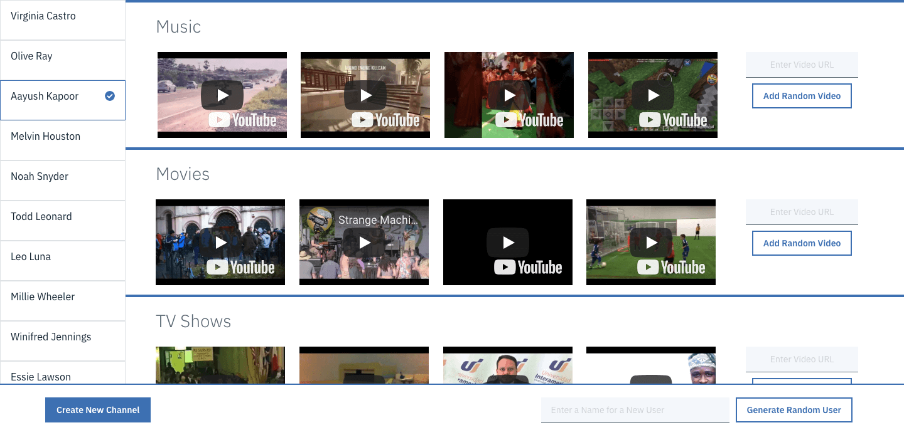
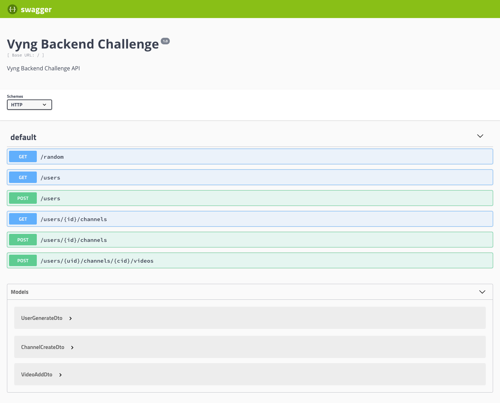

Vyng Backend Challenge

Using Postgres v10.x, NodeJS LTS+, Express v4.x, and Heroku, this is a RESTful API server which allows users to do the following:

1. Create channels with a unique name
2. Get their channels
3. Create and add a video entry to a channel.

### Models

Channel model includes at a minimum:

- Unique ID
- Name
- Owner referencing a user id

Video model includes at a minimum:

- Unique ID
- URL
- Channel referencing a channel id

User model includes at a minimum:

- Unique ID
- Name

The app is hosted on Heroku at https://vyng-backend-challenge.herokuapp.com

Swagger API is available at `/api`:

